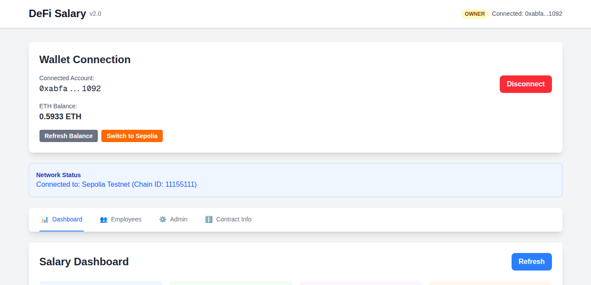
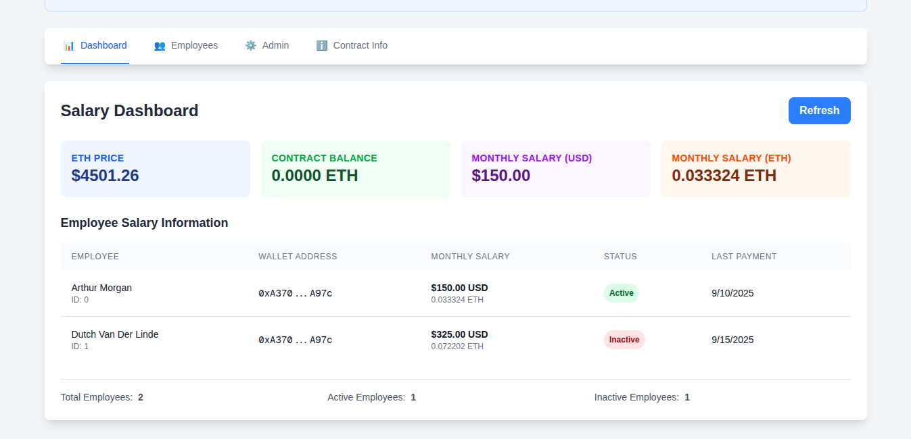
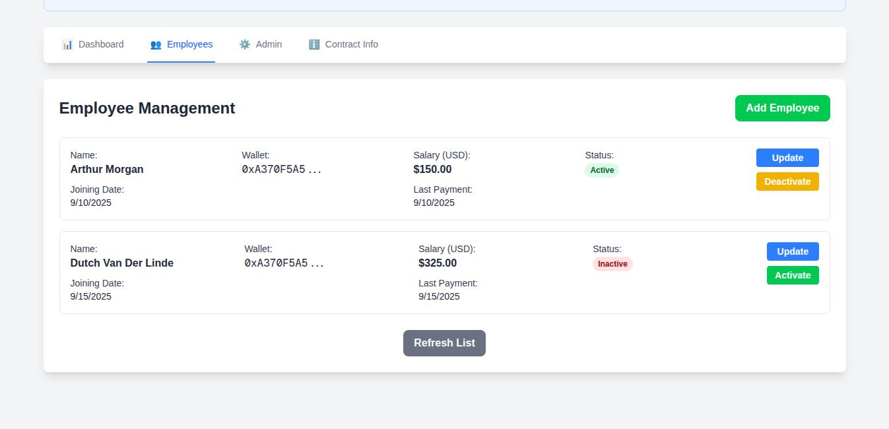
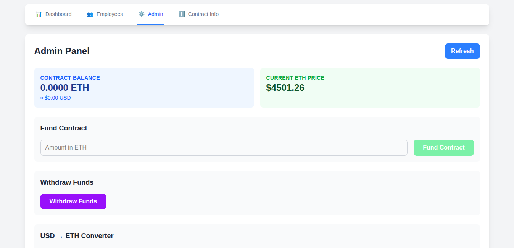
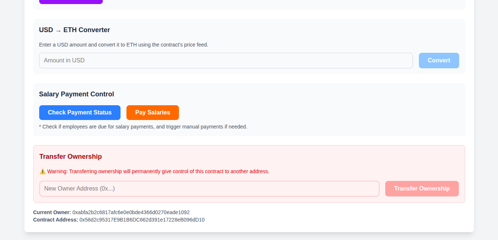
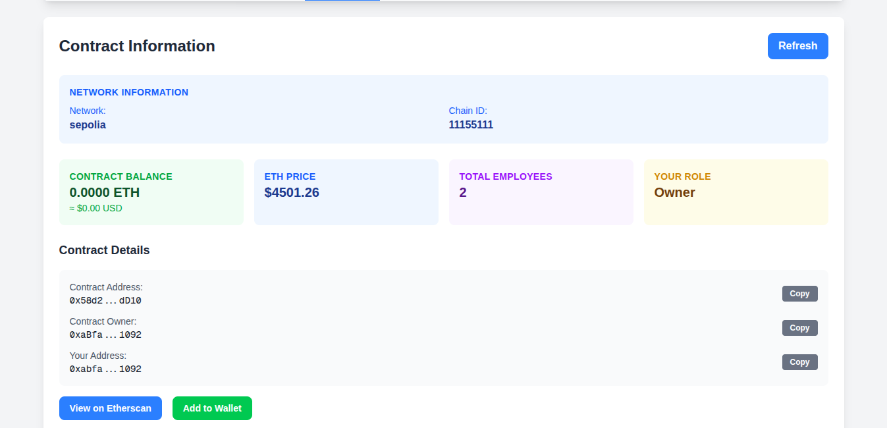
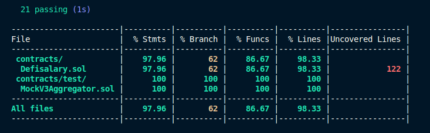

# DeFiSalary v2

## Overview

**DeFiSalary v2** is a **decentralized payroll management system** that automates salary disbursement using smart contracts.
This upgraded version focuses on **simplicity, gas efficiency, and scalability**, making it cheaper and easier for organizations to manage recurring payroll on-chain.

- **Live Application:** [https://defisalary2.vercel.app](https://defisalary2.vercel.app)
- **Smart Contract (Sepolia):** `0x58d2c95317E9B1B6DC662d391e17228eB096dD10`
- **Etherscan Link:** [View on Etherscan](https://sepolia.etherscan.io/address/0x58d2c95317E9B1B6DC662d391e17228eB096dD10)

---

## Key Improvements over v1

| Feature                        | v1 (Old)                                                                | v2 (New)                                                                        |
| ------------------------------ | ----------------------------------------------------------------------- | ------------------------------------------------------------------------------- |
| **Salary Scheduling**          | Used **BokkyPooBahsDateTimeLibrary** for date calculations (gas-heavy). | Uses a **lightweight 30-day timestamp check**, significantly reducing gas cost. |
| **Contract Size & Complexity** | More bulky, more storage operations.                                    | **Slimmed-down architecture**, fewer dependencies.                              |
| **Efficiency**                 | Required additional date computations.                                  | **Direct timestamp comparisons**, making automation cheaper.                    |
| **Maintainability**            | Harder to extend & audit.                                               | Cleaner, modular design with better event logging.                              |

---

## Features

### 👥 Employee Management

- Add, remove, and update employee details.
- Employee data stored on-chain:

  - **Name**
  - **Wallet Address**
  - **Salary Amount (USD)**
  - **Joining Date**
  - **Last Payment Date**
  - **Status (Active/Inactive)**

- Find employees by their **ID** or **wallet address**.

### 💸 Payroll System

- Salaries are automatically paid every **30 days** using Chainlink Automation.
- Salary is entered in **USD** — converted to **ETH** at the latest on-chain price using Chainlink Data Feeds.
- Admin can fund the contract and withdraw unused funds at any time.

### 📊 Admin Dashboard

- View total employees (active & inactive).
- Monitor upcoming salary payments.
- Check contract balance in **ETH & USD**.
- Add, update, or deactivate employees.
- Track payment history for each employee.

---

## How It Works

1. **Admin Adds Employee** → Adds name, wallet, salary (in USD).
2. **Contract Stores Data** → Tracks joining date & last payment date.
3. **Chainlink Automation** → Checks every 30 days and triggers `performUpkeep()` if payment is due.
4. **Salary Paid in ETH** → Contract converts USD to ETH and sends funds to employee.
5. **Events Logged** → Salary payments, employee updates, and contract actions are recorded on-chain.

---

## Tech Stack

- **Solidity (0.8.30):** Smart contract development
- **OpenZeppelin Ownable:** Role-based access control
- **Chainlink Data Feeds:** ETH/USD price conversion
- **Chainlink Automation:** Automated salary execution
- **Hardhat:** Development & testing
- **Ethers.js:** Blockchain interaction
- **Chai:** Smart contract testing
- **Next.js + Vercel:** Frontend application

---

## Installation & Local Setup

### Prerequisites

- Node.js (latest LTS version)
- MetaMask (or any Web3 wallet)

### Steps

```sh
# Clone the repository
git clone https://github.com/YashK-194/defisalary-v2.git
cd defisalary-v2

# Install dependencies
npm install

# Run local development server
npm run dev
```

- Connect MetaMask to **Sepolia Testnet**.
- Fund the contract with test ETH before adding employees.

---

## Contract Functions

| Function                                                       | Description                                                  |
| -------------------------------------------------------------- | ------------------------------------------------------------ |
| `addEmployee(name, wallet, salaryUSD)`                         | Add a new employee.                                          |
| `removeEmployee(id)`                                           | Deactivate employee (keeps historical data).                 |
| `updateEmployeeDetails(name, wallet, isActive, salaryUSD, id)` | Update employee details.                                     |
| `withdrawFunds()`                                              | Withdraw remaining contract balance to admin wallet.         |
| `checkUpkeep()`                                                | Chainlink function that checks which employees need payment. |
| `performUpkeep()`                                              | Chainlink function that executes salary payments.            |
| `getLatestETHPrice()`                                          | Fetches current ETH/USD price.                               |
| `usdToEth(amountUSD)`                                          | Converts USD to ETH (wei).                                   |

---

## Screenshots

**Homepage**


**Salary Dashboard**


**Employee Management**


**Admin Panel**



**Contract Info**


**Test Coverage**



---

## License

This project is licensed under the **MIT License**.

---

## Contact

For inquiries, reach out:

- **GitHub:** [YashK-194](https://github.com/YashK-194)
- **LinkedIn:** [linkedin.com/in/yashk194](https://www.linkedin.com/in/yashk194/)
- **Email:** [yashkm194@gmail.com](mailto:yashkm194@gmail.com)
